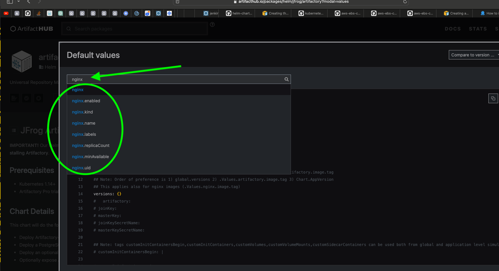
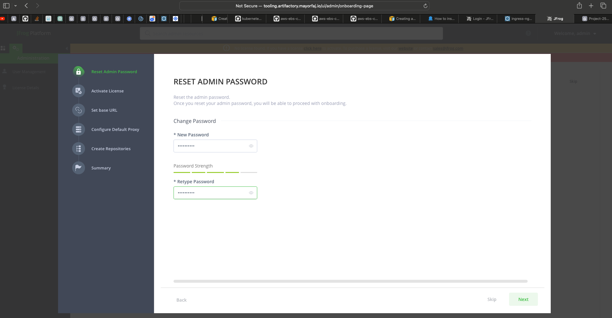
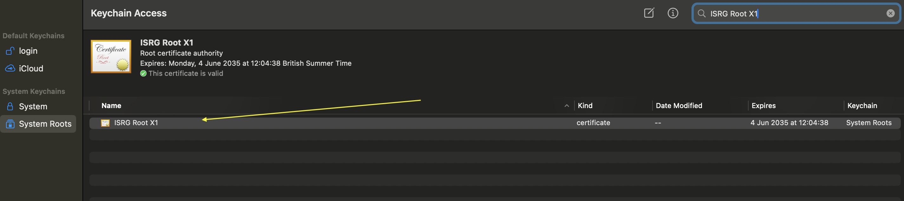

# Deploying and Packaging applications into Kubernetes with Helm

In this project, you will experience deploying more DevOps tools, get familiar with some of the real world issues faced during such deployments and how to fix them. You will learn how to tweak helm values files to automate the configuration of the applications you deploy. Finally, once you have most of the DevOps tools deployed, you will experience using them and relate with the DevOps cycle and how they fit into the entire  ecosystem.

Our focus will be on the. 

1. Artifactory
2. Ingress Controllers
3. Cert-Manager
4. Prometheus
5. Grafana
6. Elasticsearch ELK using [ECK](https://www.elastic.co/guide/en/cloud-on-k8s/current/k8s-install-helm.html)

For the tools that require paid license, don't worry, you will also learn how to get the license for free and have true experience exactly how they are used in the real world.

Lets start first with Artifactory. What is it exactly?

**Artifactory** is part of a suit of products from a company called [Jfrog](https://jfrog.com/). Jfrog started out as an artifact repository where software binaries in different formats are stored. Today, Jfrog has transitioned from an artifact repository to a DevOps Platform that includes CI and CD capabilities. This has been achieved by offering more products in which **Jfrog Artifactory** is part of. Other offerings include 

- JFrog Pipelines -  a CI-CD product that works well with its Artifactory repository. Think of this product as an alternative to Jenkins.
- JFrog Xray - a security product that can be built-into various steps within a JFrog pipeline. Its job is to scan for security vulnerabilities in the stored artifacts. It is able to scan all dependent code.

In this project, the requirement is to use Jfrog Artifactory as a private registry for the organisation's **Docker images** and **Helm charts**. This requirement will satisfy part of the company's corporate security policies to never download artifacts directly from the public into production systems. We will eventually have a CI pipeline that initially pulls public docker images and helm charts from the internet, store in artifactory and scan the artifacts for security vulnerabilities before deploying into the corporate infrastructure. Any found vulnerabilities will immediately trigger an action to quarantine such artifacts.

Lets get into action and see how all of these work.

## Deploy Jfrog Artifactory into Kubernetes

The best approach to easily get Artifactory into kubernetes is to use helm.

1. Search for an official helm chart for Artifactory on [Artifact Hub](https://artifacthub.io/)


2. Click on **See all results**

3. Then click on the first option from the result.


4. Review the artifactory page.


5. Click on the install menu on the right to see the installation commands.

6. Add the jfrog remote repository on your laptop/computer

```
helm repo add jfrog https://charts.jfrog.io
```

7. Create a namespace called `tools` where all the tools for DevOps will be deployed.

```
kubectl create ns tools
```

8. Update the helm repo index on your laptop/computer

```
helm repo update
```

9. Install artifactory

```
helm install artifactory jfrog/artifactory --version 107.71.5 -n tools
```


**NOTE:** 

- We have used `upgrade --install` flag here instead of `helm install artifactory jfrog/artifactory` This is a better practice, especially when developing CI pipelines for helm deployments. It ensures that helm does an upgrade if there is an existing installation. But if there isn't, it does the initial install. With this strategy, the command will never fail. It will be smart enough to determine if an upgrade or fresh installation is required.
- The helm chart version to install is very important to specify. So, the version at the time of writing may be different from what you will see from Artifact Hub. So, replace the version number to the desired. You can see all the versions by clicking on "see all" as shown in the image below.


The output from the installation already gives some Next step directives.

### Getting the Artifactory URL

Lets break down the first *Next Step*. 

1. The artifactory helm chart comes bundled with the `Artifactory software`, a `PostgreSQL database` and an `Nginx proxy` which it uses to configure routes to the different capabilities of Artifactory. Getting the pods after some time, you should see something like the below.

`kubectl get po -n tools -w`


2. Each of the deployed application have their respective services. This is how you will be able to reach either of them.

`kubectl get svc -n tools`


3. Notice that, the Nginx Proxy has been configured to use the service type of `LoadBalancer`. Therefore, to reach Artifactory, we will need to go through the Nginx proxy's service. Which happens to be a load balancer created in the cloud provider. Run the `kubectl` command to retrieve the Load Balancer URL.
   
```
kubectl get svc artifactory-artifactory-nginx -n tools
```
 


4. Copy the URL and paste in the browser
   


5. The default username is `admin` and the default password is `password`


### How the Nginx URL for Artifactory is configured in Kubernetes

Without clicking further on the **Get Started** page, lets dig a bit more into Kubernetes and Helm. How did Helm configure the URL in kubernetes?

Helm uses the `values.yaml` file to set every single configuration that the chart has the capability to configure. THe best place to get started with an off the shelve chart from artifacthub.io is to get familiar with the `DEFAULT VALUES`

- click on the `DEFAULT VALUES` section on Artifact hub


- Here you can search for key and value pairs


- For example, when you type `nginx` in the search bar, it shows all the configured options for the nginx proxy.



- selecting `nginx.enabled` from the list will take you directly to the configuration in the YAML file.


- Search for `nginx.service` and select `nginx.service.type`


- You will see the confired type of Kubernetes service for Nginx. As you can see, it is `LoadBalancer` by default


- To work directly with the `values.yaml` file, you can download the file locally by clicking on the download icon.


### Is the Load Balancer Service type the Ideal configuration option to use in the Real World?

Setting the service type to **Load Balancer** is the easiest way to get started with exposing applications running in kubernetes externally. But provissioning load balancers for each application can become very expensive over time, and more difficult to manage. Especially when tens or even hundreds of applications are deployed.

The best approach is to use [Kubernetes Ingress](https://kubernetes.io/docs/concepts/services-networking/ingress/) instead. But to do that, we will have to deploy an [Ingress Controller](https://kubernetes.io/docs/concepts/services-networking/ingress-controllers/).

A huge benefit of using the ingress controller is that we will be able to use a single load balancer for different applications we deploy. Therefore, Artifactory and any other tools can reuse the same load balancer. Which reduces cloud cost, and overhead of managing multiple load balancers. more on that later.

For now, we will leave artifactory, move on to the next phase of configuration (Ingress, DNS(Route53) and Cert Manager), and then return to Artifactory to complete the setup so that it can serve as a private docker registry and repository for private helm charts.

## Deploying Ingress Controller and managing Ingress Resources

Before we discuss what **Ingress controllers** are, it will be important to start off understanding about the **Ingress** resource.

An ingress is an API object that manages external access to the services in a kubernetes cluster. It is capable to provide load balancing, SSL termination and name-based virtual hosting. In otherwords, Ingress exposes HTTP and HTTPS routes from outside the cluster to services within the cluster. Traffic routing is controlled by rules defined on the Ingress resource.

Here is a simple example where an Ingress sends all its traffic to one Service:


*image credit:* kubernetes.io

An ingress resource for Artifactory would like like below

```
apiVersion: networking.k8s.io/v1
kind: Ingress
metadata:
  name: artifactory
spec:
  ingressClassName: nginx
  rules:
  - host: "tooling.artifactory.mayorfaj.io"
    http:
      paths:
      - path: /
        pathType: Prefix
        backend:
          service:
            name: artifactory
            port:
              number: 8082
```

- An Ingress needs `apiVersion`, `kind`, `metadata` and `spec` fields
- The name of an Ingress object must be a valid DNS subdomain name
- Ingress frequently uses annotations to configure some options depending on the Ingress controller.
- Different Ingress controllers support different annotations. Therefore it is important to be up to date with the ingress controller's specific documentation to know what annotations are supported.
- It is recommended to always specify the ingress class name with the spec `ingressClassName: nginx`. This is how the Ingress controller is selected, especially when there are multiple configured ingress controllers in the cluster.
- The domain `mayorfaj.io` should be replaced with your own domain. 

## Ingress controller

If you deploy the yaml configuration specified for the ingress resource without an ingress controller, it will not work. In order for the Ingress resource to work, the cluster must have an **Ingress controller** running.

Unlike other types of controllers which run as part of the kube-controller-manager. Such as the **Node Controller**, **Replica Controller**, **Deployment Controller**, **Job Controller**, or **Cloud Controller**. Ingress controllers are not started automatically with the cluster. 

Kubernetes as a project supports and maintains [AWS](https://kubernetes-sigs.github.io/aws-load-balancer-controller/v2.4/), [GCE](https://github.com/kubernetes/ingress-gce/blob/master/README.md#readme), and [NGINX](https://github.com/kubernetes/ingress-nginx/blob/main/README.md#readme) ingress controllers.

There are many other 3rd party Ingress controllers that provide similar functionalities with their own unique features, but the 3 mentioned earlier are currently supported and maintained by Kubernetes. Some of these other 3rd party Ingress controllers include but not limited to the following;

- [AKS Application Gateway Ingress Controller](https://docs.microsoft.com/en-gb/azure/application-gateway/tutorial-ingress-controller-add-on-existing) (**Microsoft Azure**)
- [Istio](https://istio.io/latest/docs/tasks/traffic-management/ingress/kubernetes-ingress/)
- [Traefik](https://doc.traefik.io/traefik/providers/kubernetes-ingress/)
- [Ambassador](https://www.getambassador.io/)
- [HA Proxy Ingress](https://haproxy-ingress.github.io/)
- [Kong](https://docs.konghq.com/kubernetes-ingress-controller/)
- [Gloo](https://docs.solo.io/gloo-edge/latest/)

An example comparison matrix of some of the controllers can be found [here](https://kubevious.io/blog/post/comparing-top-ingress-controllers-for-kubernetes#comparison-matrix). Understanding their unique features will help businesses determine which product works well for their respective requirements.

It is possible to deploy any number of ingress controllers in the same cluster. That is the essence of an **ingress class**. By specifying the spec `ingressClassName` field on the ingress object, the appropriate ingress controller will be used by the ingress resource.

Lets get into action and see how all of these fits together.

### Deploy Nginx Ingress Controller

On this project, we will deploy and use the **Nginx Ingress Controller**. It is always the default choice when starting with Kubernetes projects. It is reliable and easy to use.

Since this controller is maintained by Kubernetes, there is an official guide the installation process. Hence, we wont be using **artifacthub.io** here. Even though you can still find ready to go charts there, it just makes sense to always use the [official guide](https://kubernetes.github.io/ingress-nginx/deploy/) in this scenario.

Using the **Helm** approach, according to the official guide;

1. Install Nginx Ingress Controller in the `ingress-nginx` namespace

```
helm upgrade --install ingress-nginx ingress-nginx \
  --repo https://kubernetes.github.io/ingress-nginx \
  --namespace ingress-nginx --create-namespace
```


**Notice**:  

This command is idempotent:

- if the ingress controller is not installed, it will install it,
- if the ingress controller is already installed, it will upgrade it.

- **Self Challenge Task** - Delete the installation after running above command. Then try to re-install it using a slightly different method you are already familiar with. Ensure NOT to use the flag `--repo`
- **Hint** - Run the `helm repo add command` before installation

2. A few pods should start in the ingress-nginx namespace:

```
kubectl get pods --namespace=ingress-nginx
```


3. After a while, they should all be running. The following command will wait for the ingress controller pod to be up, running, and ready:

```
kubectl wait --namespace ingress-nginx \
  --for=condition=ready pod \
  --selector=app.kubernetes.io/component=controller \
  --timeout=120s
```

4. Check to see the created load balancer in AWS.

```
   kubectl get service -n ingress-nginx
```


The `ingress-nginx-controller` service that was created is of the type `LoadBalancer`. That will be the load balancer to be used by all applications which require external access, and is using this ingress controller.

If you go ahead to AWS console, copy the address in the **EXTERNAL-IP** column, and search for the loadbalancer, you will see an output like below.


5. Check the IngressClass that identifies this ingress controller.

```
kubectl get ingressclass -n ingress-nginx
```

Output:
```
mayor@Dev EBSCSI-Driver % kubectl get ingressclass -n ingress-nginx
NAME    CONTROLLER             PARAMETERS   AGE
nginx   k8s.io/ingress-nginx   <none>       18m
```

### Deploy Artifactory Ingress

Now, it is time to configure the ingress so that we can route traffic to the Artifactory internal service, through the ingress controller's load balancer.
Notice the `spec` section with the configuration that selects the ingress controller using the **ingressClassName** 

```
apiVersion: networking.k8s.io/v1
kind: Ingress
metadata:
  name: artifactory
spec:
  ingressClassName: nginx
  rules:
  - host: "tooling.artifactory.mayorfaj.io"
    http:
      paths:
      - path: /
        pathType: Prefix
        backend:
          service:
            name: artifactory
            port:
              number: 8082
```

```
kubectl apply -f artifactory-ingress.yaml -n tools
```

`kubectl get ingress -n tools`

Output:


Now, take note of

- CLASS - The nginx controller class name `nginx`
- HOSTS - The hostname to be used in the browser `tooling.artifactory.mayorfaj.io`
- ADDRESS - The loadbalancer address that was created by the ingress controller

## Configure DNS

If anyone were to visit the tool, it would be very inconvenient sharing the long load balancer address. Ideally, you would create a DNS record that is human readable and can direct request to the balancer. This is exactly what has been configured in the ingress object `- host: "tooling.artifactory..mayorfaj.io"` but without a DNS record, there is no way that host address can reach the load balancer.

The `mayorfaj.io` part of the domain is the configured **HOSTED ZONE** in AWS. So you will need to configure Hosted Zone in AWS console or as part of your infrastructure as code using terraform. 


If you purchased the domain directly from AWS, the hosted zone will be automatically configured for you. But if your domain is registered with a different provider such as **freenom** or **namechaep**, you will have to create the hosted zone and update the name servers.

### Create Route53 record

Within the hosted zone is where all the necessary DNS records will be created. Since we are working on Artifactory, lets create the record to point to the ingress controller's loadbalancer. There are 2 options. You can either use the *CNAME* or AWS *Alias*

#### **CNAME Method**

1. Select the **HOSTED ZONE** you wish to use, and click on the create record button


2. Add the subdomain `tooling.artifactory`, and select the record type `CNAME`


3. Successfully created record


4. Confirm that the DNS record has been properly propergated. Visit [https://dnschecker.org](https://dnschecker.org) and check the record. Ensure to select CNAME. The search should return green ticks for each of the locations on the left.


#### **AWS Alias Method**

1. In the create record section, type in the record name, and toggle the `alias` button to enable an alias. An alias is of the `A` DNS record type which basically routes directly to the load balancer. In the `choose endpoint` bar, select `Alias to Application and Classic Load Balancer``
Select the region and the load balancer required. You will not need to type in the load balancer, as it will already populate.


For detailed read on selecting between CNAME and Alias based records, read the [official documentation](https://docs.aws.amazon.com/Route53/latest/DeveloperGuide/resource-record-sets-choosing-alias-non-alias.html)

### Visiting the application from the browser

So far, we now have an application running in Kubernetes that is also accessible externally. That means if you navigate to [http://tooling.artifactory.mayorfaj.io](http://tooling.artifactory.mayorfaj.io) (*replace the full URL with your domain*), it should load up the artifactory application. 


Using Chrome browser will show something like the below. It shows that the site is indeed reachable, but insecure. It is insecure because it either does not have a trusted TLS/SSL certificate, or it doesn't have any at all.


### Explore Artifactory Web UI

Now that we can access the application externally, although insecure, its time to login for some exploration. Afterwards we will make it a lot more secure and access our web application on any browser.

1. Get the default username and password - Run a helm command to output the same message after the initial install

```
helm test artifactory -n tools
```

Output:
```
mayor@Dev Deploying-and-Packing-Application-into-Kubernetes-with-Helm_P25 % helm test artifactory -n tools
NAME: artifactory
LAST DEPLOYED: Wed Nov 22 22:52:12 2023
NAMESPACE: tools
STATUS: deployed
REVISION: 1
TEST SUITE: None
NOTES:
Congratulations. You have just deployed JFrog Artifactory!

1. Get the Artifactory URL by running these commands:

   NOTE: It may take a few minutes for the LoadBalancer IP to be available.
         You can watch the status of the service by running 'kubectl get svc --namespace tools -w artifactory-artifactory-nginx'
   export SERVICE_IP=$(kubectl get svc --namespace tools artifactory-artifactory-nginx -o jsonpath='{.status.loadBalancer.ingress[0].ip}')
   echo http://$SERVICE_IP/

2. Open Artifactory in your browser
   Default credential for Artifactory:
   user: admin
   password: password
```

2. Insert the username and password to load the Get Started page


3. Reset the admin password



4. Activate the Artifactory License. You will need to purchase a license to use Artifactory enterprise features. 
    


5. For learning purposes, you can apply for a free trial license. [Simply fill the form here](https://jfrog.com/start-free/) and a license key will be delivered to your email in few minutes.


6. In exactly 1 minute, the license key had arrived. Simply copy the key and apply to the console.


7. Set the Base URL. Ensure to use `https`
  


8. Skip the Proxy setting 


9. Skip creation of repositories for now. You will create them yourself later on.
      


10. finish the setup
     


Next, its time to fix the TLS/SSL configuration so that we will have a trusted **HTTPS** URL

## Deploying Cert-Manager and managing TLS/SSL for Ingress

Transport Layer Security (TLS), the successor of the now-deprecated Secure Sockets Layer (SSL), is a cryptographic protocol designed to provide communications security over a computer network.

The TLS protocol aims primarily to provide cryptography, including privacy (confidentiality), integrity, and authenticity through the use of certificates, between two or more communicating computer applications.

The certificates required to implement TLS must be issued by a trusted Certificate Authority (CA).

To see the list of trusted root Certification Authorities (CA) and their certificates used by Google Chrome, you need to use the Certificate Manager built inside Google Chrome as shown below:

1. Open the settings section of google chrome
   
2. Search for `security`


3. Select `Manage Certificates` 


4. View the installed certificates in your browser


## Certificate Management in Kubernetes

Ensuring that trusted certificates can be requested and issued from certificate authorities dynamically is a tedious process. Managing the certificates per application and keeping track of expiry is also a lot of overhead.

To do this, administrators will have to write complex scripts or programs to handle all the logic.

[Cert-Manager](https://cert-manager.io/) comes to the rescue! 

cert-manager adds certificates and certificate issuers as resource types in Kubernetes clusters, and simplifies the process of obtaining, renewing and using those certificates.

Similar to how Ingress Controllers are able to enable the creation of *Ingress* resource in the cluster, so also cert-manager enables the possibility to create certificate resource, and a few other resources that makes certificate management seamless.

It can issue certificates from a variety of supported sources, including [Let's Encrypt](https://letsencrypt.org/), [HashiCorp Vault](https://www.vaultproject.io/), and [Venafi](https://www.venafi.com/) as well as [private PKI](https://www.csoonline.com/article/3400836/what-is-pki-and-how-it-secures-just-about-everything-online.html). The issued certificates get stored as kubernetes secret which holds both the private key and public certificate.

For this project, We will use `Let's Encrypt` with cert-manager. The certificates issued by Let's Encrypt will work with most browsers because the root certificate that validates all it's certificates is called **“ISRG Root X1”** which is already trusted by most browsers and servers.

You will find `ISRG Root X1` in the list of certificates already installed in your browser.



Cert-maanager will ensure certificates are valid and up to date, and attempt to renew certificates at a configured time before expiry.

## Cert-Manager high Level Architecture

Cert-manager works by having administrators create a resource in kubernetes called **certificate issuer** which will be configured to work with supported sources of certificates. This issuer can either be scoped **globally** in the cluster or only local to the namespace it is deployed to.

Whenever it is time to create a certificate for a specific host or website address, the process follows the pattern seen in the image below.


After we have deployed cert-manager, you will see all of this in action.

## Deploying Cert-manager

1. Before installing the chart, you must first install the cert-manager `CustomResourceDefinition` resources. This is performed in a separate step to allow you to easily uninstall and reinstall cert-manager without deleting your installed custom resources.

```
kubectl apply -f https://github.com/cert-manager/cert-manager/releases/download/v1.13.2/cert-manager.crds.yaml
```


2. Add repo

```
helm repo add jetstack https://charts.jetstack.io
helm repo update jetstack
```

3. Create namespace

`kubectl create ns cert-manager`

4. Install the cert-manager helm chart

```
helm install cert-manager --namespace cert-manager --version v1.13.2 jetstack/cert-manager
```

You should see an output like this 


### Certificate Issuer

Next, is to create an Issuer. We will use a **Cluster Issuer** so that it can be scoped globally. Assuming that we will be using **darey.io** domain. Simply update this yaml file and deploy with **kubectl**. In the section that follows, we will break down each part of the file.


```
apiVersion: cert-manager.io/v1
kind: ClusterIssuer
metadata:
  namespace: "cert-manager"
  name: "letsencrypt-prod"
spec:
  acme:
    server: "https://acme-v02.api.letsencrypt.org/directory"
    email: "infradev@oldcowboyshop.com"
    privateKeySecretRef:
      name: "letsencrypt-prod"
    solvers:
    - selector:
        dnsZones:
          - "mayorfaj.io"
      dns01:
        route53:
          region: "eu-central-1"
          hostedZoneID: "Z00832511F42WSIES17T7"
```

`kubectl apply -f certmanager-issuer.yaml -n cert-manager`

**Output**
```
clusterissuer.cert-manager.io/letsencrypt-prod created
```

Lets break down the content to undertsand all the sections

- Section 1 - The standard kubernetes section that defines the **apiVersion**, **Kind**, and **metadata**. The Kind here is a ClusterIssuer which means it is scoped globally (used to configure certificate issuers for the entire Kubernetes cluster).

```
    apiVersion: cert-manager.io/v1
    kind: ClusterIssuer
    metadata:
    namespace: "cert-manager"
    name: "letsencrypt-prod"
```

- Section 2 - In the spec section, an [**ACME**](https://cert-manager.io/docs/configuration/acme/) - Automated Certificate Management Environment issuer type is specified here. When you create a new ACME Issuer, cert-manager will generate a private key which is used to identify you with the ACME server.
  
Certificates issued by public ACME servers are typically trusted by client's computers by default. This means that, for example, visiting a website that is backed by an ACME certificate issued for that URL, will be trusted by default by most client's web browsers. ACME certificates are typically free.
  
Let’s Encrypt uses the ACME protocol to verify that you control a given domain name and to issue you a certificate. You can either use the let's encrypt **Production** server address `https://acme-v02.api.letsencrypt.org/directory` which can be used for all production websites. Or it can be replaced with the staging URL `https://acme-staging-v02.api.letsencrypt.org/directory` for all **Non-Production** sites.

The `privateKeySecretRef` has configuration for the private key name you prefer to use to store the ACME account private key. This can be anything you specify, for example **letsencrypt-prod** 

```
    spec:
     acme:
        # The ACME server URL
        server: "https://acme-v02.api.letsencrypt.org/directory"
        email: "mayorfaj.io@gmail.com"
        # Name of a secret used to store the ACME account private key
        privateKeySecretRef:
        name: "letsencrypt-prod"
```

- Section 3 - This section is part of the `spec` that configures `solvers` which determines the domain address that the issued certificate will be registered with. `dns01` is one of the different challenges that cert-manager uses to verify domain ownership. [Read more on DNS01 Challenge here](https://letsencrypt.org/docs/challenge-types/#dns-01-challenge). With the **DNS01** configuration, you will need to specify the Route53 DNS Hosted Zone ID and region. 

**Take note of this part;**
**Since we are using EKS in AWS, the IAM permission of the worker nodes will be used to access Route53. Therefore if appropriate permissions is not set for EKS worker nodes, it is possible that certificate challenge with Route53 will fail, hence certificates will not get issued.**
  
The other possible option is the [HTTP01](https://cert-manager.io/docs/configuration/acme/http01/#configuring-the-http01-ingress-solver) challenge, but we won't be using that here.

```
      solvers:
        - selector:
            dnsZones:
            - "mayorfaj.io"
        dns01:
            route53:
            region: "eu-central-1"
            hostedZoneID: "Z00832511F42WSIES17T7"
```

With the ClusterIssuer properly configured, it is now time to start getting certificates issued. 

Lets see what that looks like in the next section.

**Configuring Ingress for TLS**

To ensure that every created ingress also has TLS configured, we will need to update the ingress manifest with TLS specific configurations.

```
apiVersion: networking.k8s.io/v1
kind: Ingress
metadata:
  annotations:
    cert-manager.io/cluster-issuer: "letsencrypt-prod"
  name: artifactory
spec:
  ingressClassName: nginx
  rules:
  - host: "tooling.artifactory.mayorfaj.io"
    http:
      paths:
      - path: /
        pathType: Prefix
        backend:
          service:
            name: artifactory
            port:
              number: 8082
  tls:
  - hosts:
    - "tooling.artifactory.mayorfaj.io"
    secretName: "tooling.artifactory.mayorfaj.io"
```

`kubectl apply -f artifactory-ingress.yaml -n tools`

The most significant updates to the ingress definition is the `annotations` and `tls` sections.

Lets quickly talk about Annotations. **Annotations** are used similar to `labels` in kubernetes. They are ways to attach metadata to objects.

## Differences between Annotations and Labels

**Labels** are used in conjunction with selectors to identify groups of related resources. Because selectors are used to query labels, this operation needs to be efficient. To ensure efficient queries, labels are constrained by RFC 1123. RFC 1123, among other constraints, restricts labels to a maximum 63 character length. Thus, labels should be used when you want Kubernetes to group a set of related resources.

**Annotations** are used for “non-identifying information” i.e., metadata that Kubernetes does not care about. As such, annotation keys and values have no constraints. Thus, if you want to add information for other humans about a given resource, then annotations are a better choice.

The Annotation added to the Ingress resource adds metadata to specify the issuer responsible for requesting certificates. The issuer here will be the same one we have created earlier with the name`letsencrypt-prod`.

```
  annotations:
    cert-manager.io/cluster-issuer: "letsencrypt-prod"
```

The other section is `tls` where the host name that will require `https` is specified. The `secretName` also holds the name of the secret that will be created which will store details of the certificate key-pair. i.e Private key and public certificate. 


```
  tls:
  - hosts:
    - "tooling.artifactory.sandbox.svc.darey.io"
    secretName: "tooling.artifactory.sandbox.svc.darey.io"
```

Redeploying the newly updated ingress will go through the process as shown below.


Once deployed, you can run the following commands to see each resource at each phase.

- `kubectl get certificaterequest -n tools`
- `kubectl get order -n tools`
- `kubectl get challenge -n tools`
- `kubectl get certificate -n tools`

At each stage you can run **describe** on each resource to get more information on what cert-manager is doing.

After applying the above command, i ran into some issues, my certicate remains in pending state.


I ran describe on the the challenge resource to troubleshoot further


The error message "AccessDenied: User is not authorized to perform route53:ChangeResourceRecordSets" and "route53:GetChange" indicates that the IAM role assumed by your Kubernetes cluster nodes (in this case, eksctl-rias-billind-dev2-nodegroup-NodeInstanceRole-01FrQFv3ZZQu/i-0e7003b18a1068762) does not have the necessary permissions to modify DNS records in Route 53.

**Steps taken  to resolve**

- Identify the IAM role assumed by your EKS cluster nodes. In your case, it's eksctl-rias-billind-dev2-nodegroup-NodeInstanceRole-01FrQFv3ZZQu


- Modify the IAM policy associated with this role to include the necessary permissions for Route 53. You should grant permissions for the `route53:ChangeResourceRecordSets` `route53:GetChange` action on the specific hosted zone (arn:aws:route53:::hostedzone/Z00832511F42WSIES17T7).

- 

You can see that the `route53:ChangeResourceRecordSets` is not included in the permission policy. Le's go ahead to modify that

- Create IAM policy to be added to the role's policy:

```
{
    "Version": "2012-10-17",
    "Statement": [
        {
            "Sid": "Statement",
            "Effect": "Allow",
            "Action": [
                "route53:ChangeResourceRecordSets",
                "route53:GetChange"
            ],
            "Resource": [
                "arn:aws:route53:::hostedzone/Z00832511F42WSIES17T7",
                "arn:aws:route53:::change/C02519761BDQF35ZQCTO8"
            ]
        }
    ]
}

```

- Apply the updated IAM policy to the IAM role. You can do this through the AWS Management Console or by using the AWS CLI.

```
aws iam put-role-policy \
    --role-name eksctl-rias-billind-dev2-nodegroup-NodeInstanceRole-01FrQFv3ZZQu \
    --policy-name AdditionalRoute53Permissions \
    --policy-document file://CRRS-policy.json
```

`echo $?`

If the output is 0, it means the last command was successful. If it's a non-zero value, it indicates an error.


- Verify that the IAM role has the correct trust relationship with the EKS cluster. The trust relationship should allow the EKS cluster to assume the role.

```
{
    "Version": "2012-10-17",
    "Statement": [
        {
            "Effect": "Allow",
            "Principal": {
                "Service": [
                    "eks.amazonaws.com",
                    "ec2.amazonaws.com"
                ]
            },
            "Action": "sts:AssumeRole"
        }
    ]
}
```


After making sure that the IAM role has the correct permissions and trust relationship, retest the certificate issuance process

If all goes well, run the commands again,you should see an output like below.


Notice the secret name there in the above output.  Executing the command `kubectl get secrettooling.artifactory.mayorfaj.io -o yaml`, you will see the `data` with encoded version of both the private key `tls.key` and the public certificate `tls.crt`. This is the actual certificate configuration that the ingress controller will use as part of Nginx configuration to terminate TLS/SSL on the ingress.

If you now head over to the browser, you should see the padlock sign without warnings of untrusted certificates.


Finally, one more task for you to do is to ensure that the LoadBalancer created for artifactory is destroyed. If you run a get service kubectl command like below;

```
kubectl get service -n tools
```


You will see that the load balancer is still there. 

Another task is to update the helm values file for artifactory, and ensure that the `artifactory-artifactory-nginx` service uses `ClusterIP`

Run the commands below, to have a view of the artifactory configuration file

`helm show values jfrog/artifactory`

Redirect the values to a file

```
helm show values jfrog/artifactory > values.yaml
```

Replace the LoadBalancer created for artifactory with ClustyerIP

```
helm upgrade artifactory jfrog/artifactory --set nginx.service.type=ClusterIP,databaseUpgradeReady=true -n tools
```


Run a get service kubectl command like below to confirm the loadbalnacer is gone;

```
kubectl get service -n tools
```


Finally, update the ingress to use `artifactory-artifactory-nginx` as the backend service instead of using `artifactory`. Remember to update the port number as well.


If everything goes well, you will be prompted at login to set the BASE URL. It will pick up the new `https` address. Simply click next 


Skip the `proxy` part of the setup.

Skip repositories creation because we will configure all of this in the next project

Then complete the setup.


Congratulations!

[Link]() to next project

[Deploying Grafana, Prometheus and Elasticsearch in Kubernetes Cluster Using Helm]()